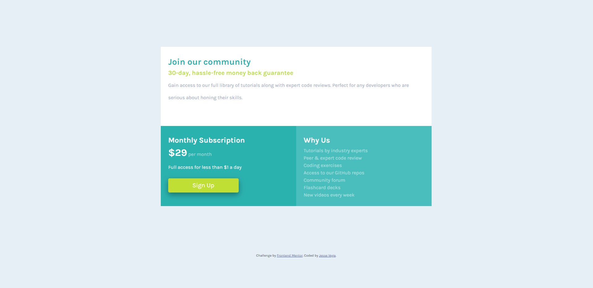

# Frontend Mentor - Single price grid component solution

This is a solution to the [Single price grid component challenge on Frontend Mentor](https://www.frontendmentor.io/challenges/single-price-grid-component-5ce41129d0ff452fec5abbbc). Frontend Mentor challenges help you improve your coding skills by building realistic projects. 

## Table of contents

- [Overview](#overview)
  - [The challenge](#the-challenge)
  - [Screenshot](#screenshot)
  - [Links](#links)
- [My process](#my-process)
  - [Built with](#built-with)
  - [What I learned](#what-i-learned)
  - [Continued development](#continued-development)
  - [Useful resources](#useful-resources)
- [Author](#author)
- [Acknowledgments](#acknowledgments)

**Note: Delete this note and update the table of contents based on what sections you keep.**

## Overview

### The challenge

Users should be able to:

- View the optimal layout for the component depending on their device's screen size
- See a hover state on desktop for the Sign Up call-to-action

### Screenshot



### Links

- Solution URL: [Add solution URL here](https://github.com/EnvyMe/single-price-grid)
- Live Site URL: [Add live site URL here](https://envyme.github.io/single-price-grid/)

## My process

Just a simple project using Bootstrap 5 grid system to create a responsive price card.

### Built with

- Semantic HTML5 markup
- CSS custom properties
- Bootstrap 5

### What I learned

Reinforced knowledge of using margins and padding to properly position divs and the text within them. Used media query to change padding at appropriate screen size.

```css
@media screen and (max-width: 1000px) {
    body .main-window{
        padding: 8% 30%;
    }
}
```

### Continued development

None at the moment.

### Useful resources

- [Bootstrap 5 Documentation](https://getbootstrap.com/docs/5.0/getting-started/introduction/) - An important resource for working with Bootstraps grid system.

## Author

- Website - [Jesse Vega](https://www.linkedin.com/in/jesse-vega-2922b57a/)
- Frontend Mentor - [@EnvyMe](https://www.frontendmentor.io/profile/EnvyMe)
- Twitter - [@VegaPlaysSega](https://twitter.com/VegaPlaysSega)
